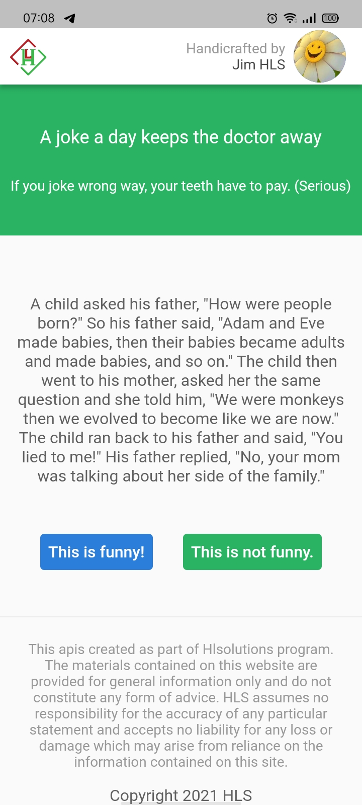
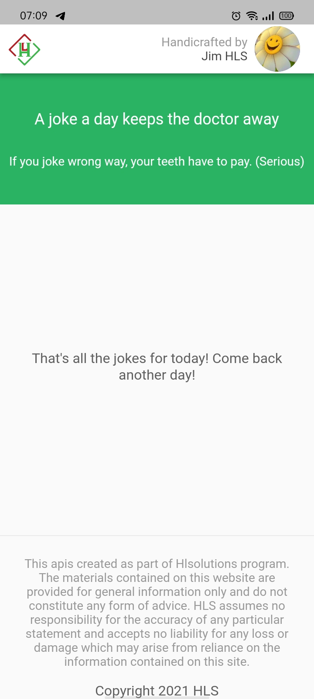
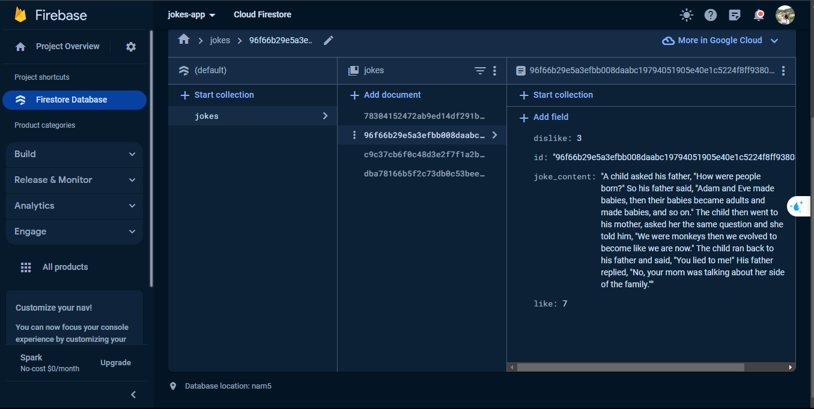

# mobile

A Flutter project is the solution for [hl-assignment: mobile](https://github.com/hl-solutions/hl-assignment/tree/master/mobile).

## Getting Started

This project is a starting point for a Flutter application.

A few resources to get you started if this is your first Flutter project:

- [Lab: Write your first Flutter app](https://docs.flutter.dev/get-started/codelab)
- [Cookbook: Useful Flutter samples](https://docs.flutter.dev/cookbook)

For help getting started with Flutter development, view the
[online documentation](https://docs.flutter.dev/), which offers tutorials,
samples, guidance on mobile development, and a full API reference.

## Technology

- Flutter vs. Dart
- Firebase

## Results

- Mobile UI:

  - Show joke to read:
    

  - No more joke:
    

- Counting vote is stored on Firebase:
  

  If you can't see result images on README file, please open this [drive](https://drive.google.com/drive/folders/1KejG4_RQ2Y5lIkxcmqNVSs_aiYxSWXHv?usp=drive_link)
